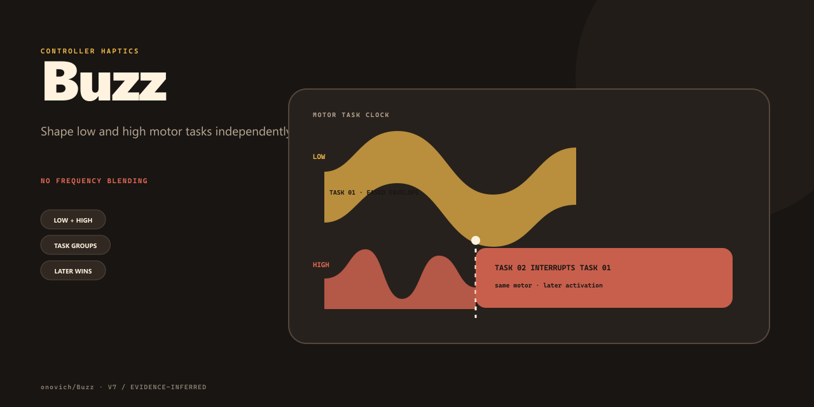

# Buzz

[English](README.md)

轻量手柄震动库，可分别编排低频、高频震动任务及生命周期。



## 项目包含什么

- 分别控制低频与高频马达。
- 震动任务生命周期。
- 可直接用于 Unity。

## 快速开始

在 Unity 中打开 **Window → Package Manager**，选择 **Add package from git URL**，输入：

```text
https://github.com/onovich/Buzz.git?path=/Assets/com.tenon.buzz#main
```

包元数据声明支持 Unity `2019.4` 及以上版本。

## 仓库结构

- `Assets/` — Unity 脚本、场景、包与项目资源。
- `Packages/` — Unity 包依赖。
- `.editorconfig` — 仓库组成部分。
- `.vscode` — 仓库组成部分。
- `LICENSE/` — 仓库组成部分。

## 当前状态

当前仓库将 Buzz 标记为稳定可用。它有意不做频率混合：同一马达上后触发的任务会打断先前任务。

## 许可证

本仓库采用 [MIT](LICENSE) 许可证。
